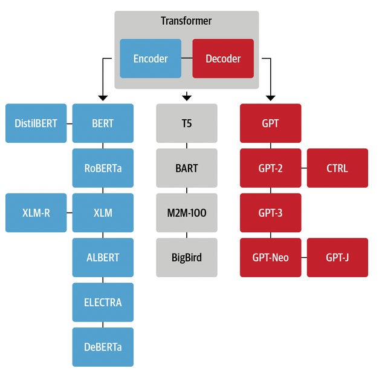

## Reimplementing Transformers T5

Based on the notion that you cannot really understand something unless you do it, I try in this repository to reimplement T5 that is found on the [hugging face repo](https://github.com/huggingface/transformers). This repos is very active and mature. I will try to follow the same modular structure of the code.



### 1. What is here for you?

1. I will add more comments while rewriting the code in case anyone wanted to do this again should find understanding the code easier.

2. The explanation section here will contain a detailed explanation of some the concepts necessary to understand the code which will be very difficult to find in one place and all the explanations here are things I encountered during the rewriting of the code.

3. Anyone is welcome to join me in this journey, and add to the explanation section, or to add more clarifying comments.

4. You are more than welcome if you want to add categorizations to the Explanations as they grow to make them more readable. Just send me a Pull Request.

> I added what I think is useful to know. Of course, I might know a lot of things that find it easy for me that don't need explanation which is not the case with anyone depending on your level of expertise. If you struggeled to understand something, follow my same process and send me a Pull Request.

### 2. Benefits

1. Understand how to write production-level code with advanced capabilities that you rarely think of when implementing something smaller.

2. Understand more the transformers (Encoder & Decoder) since T5 contains both the Encoder and Decoder.

3. Seeing what utility functions the transformers need to operate as we see. The model and tokenizer is just part of the process, but there are other details that will be difficult to figure out unless you implement them by yourself.

### 3. Linting and Code Format

<details>

<summary> I used these settings in VS code for linting and formating the code. </summary>

```
{
    "workbench.colorTheme": "Quiet Light",
    "editor.fontSize": 15,
    "editor.formatOnSave": true,
    "python.linting.enabled": true,
    "python.linting.flake8Enabled": true,
    "python.formatting.provider": "black",
    "python.formatting.blackArgs": [
        "--line-length",
        "100"
    ],
    "isort.args": [
        "--profile",
        "black"
    ],
    "python.linting.flake8Args": [
        "--max-line-length",
        "100",
        "--ignore=W605,E203,W503"
    ],
    "[python]": {
        "editor.codeActionsOnSave": {
            "source.organizeImports": true
        },
        "editor.formatOnType": true
    },
    "python.linting.pylintEnabled": false,
    "python.testing.pytestArgs": [
        "components"
    ],
    "python.testing.unittestEnabled": false,
    "python.testing.pytestEnabled": true,
    "redhat.telemetry.enabled": false
}
```

</details>

<br>

### 4. Explanations

<details>

<summary> In the context of this file `src/transformers/utils/logging.py` </summary>

* `# NOQA`: is used in some linting tools (such as flake8 in Python) to indicate that a particular line of code should not be linted (checked for compliance with coding standards). In this case, the comment is used to prevent the linter from complaining about unused imports, which is often triggered by the fact that some of the imported log levels are not actually used in the code. The `NOQA` stands for "no quality assurance", meaning that the linter should ignore this line and not flag it as a problem. In general, you may choose to import things that are not immediately used in your code for various reasons. *For example, you may be planning on using those imported elements in the future, or you might want to make it easier for others who read your code to understand what modules and elements are available for use.*

* `logging.Handler`: A class in the Python standard library's logging module, which provides a flexible logging system for applications. It is used to send log messages to specific destinations, such as a file, a stream, or a socket.

* `logging.getLogger()`: A logger is used to send log messages of various severity levels to one or more handlers, which are responsible for sending the log messages to their final destinations (e.g. a file, a stream, or a socket). Loggers are organized in a hierarchy based on their names, with the root logger being at the top of the hierarchy and named "root". By calling `logging.getLogger()` with no arguments, you get the root logger, which is the default logger for the entire application. You can also get a logger with a specific name by passing the name as an argument to `logging.getLogger(name)`, which will create a new logger or return an existing one with the same name.

* `global variable`: In Python, the global keyword is used to indicate that a variable is a global variable and can be accessed from anywhere in the code, including inside functions. Without the global keyword, a variable would be treated as a local variable, and any changes to its value would only be visible within the function. By using the global keyword, you can ensure that changes to the value of the variable are visible outside the function as well.

* `with _lock`: This statement is using a lock object (`_lock`) to ensure that only one thread is executed at a time within the block of code following the `with` statement. Locks are used in multithreaded programming to prevent multiple threads from accessing shared resources simultaneously, which can cause data races and other synchronization problems. By acquiring the lock with `with _lock:`, the function guarantees that the rest of the code within the block is executed by only one thread at a time. This ensures that the library root logger is only configured once, even if multiple threads try to access the function simultaneously. This is important because if multiple threads try to configure the library root logger at the same time, it could result in unpredictable behavior, such as log messages being lost or duplicated, or the log handler being added multiple times. The lock ensures that this does not happen by making the function thread-safe.

*  `sys.stderr` Vs `sys.stdout`: `sys.stderr` and `sys.stdout` are both standard streams in Python that represent input and output for the Python interpreter. `sys.stdout` is the standard output stream and is typically used to display normal output from a Python program. This is where print statements, for example, will write their output by default. `sys.stderr`, on the other hand, is the standard error stream and is used to display error messages or other diagnostic information. This stream is separate from `sys.stdout`, and is typically used to report errors or exceptions that occur during program execution. Having both streams separately allows the user to separate normal program output from error messages, which can be useful in a variety of situations.

* `StreamHandler`: Is a type of handler provided by the Python standard library's logging module. `By default, logging.StreamHandler()` sends log messages to the standard error stream, `sys.stderr`. The StreamHandler takes an optional stream argument, which allows you to specify an alternate stream to use instead of `sys.stderr`. However, if the stream argument is not provided, StreamHandler will use `sys.stderr` as the default stream. The default behavior is typical and allows you to easily send log messages to the standard error stream for diagnosis and error reporting.

* `stream_name.flush`: Flushing a stream, such as the default `sys.stderr` in `logging.StreamHandler()`, means that any buffered data is written to the stream immediately, rather than being buffered and written at a later time. It ensures that any buffered data is written to the stream immediately, rather than being held in the buffer. Flushing does not delete messages that have already been written to the stream, but it does make room in the buffer for new messages. By flushing the buffer after each log message, you can ensure that the buffer is always ready to receive new messages and that log messages are written to the stream in a timely manner. In the case of `sys.stderr`, flushing the stream immediately can be useful to ensure that error messages or other important information are written to the stream as soon as possible, rather than being buffered and potentially not being written until later. This can be important in some cases to ensure that critical information is not lost or overlooked. However, flushing a stream too frequently can also have performance implications, as it can slow down the program and reduce efficiency. As with many things in programming, it's a trade-off between ensuring that important information is available immediately and minimizing the performance impact of flushing.

* `library_root_logger.propagate`: The `propagate` attribute in logging is a boolean value that determines whether events from this logger will be passed to its parent logger. If `propagate` is set to `True`, events from this logger will be passed to its parent logger, which could then handle the events. If `propagate` is set to `False`, events from this logger will not be passed to its parent logger, meaning that events will be handled solely by this logger.

* `logging.NOTSET`: A constant used in the Python logging module to set the logging level of a logger to the lowest possible level. The logging levels in Python are defined as constants in the `logging` module and are used to determine which log messages will be processed and which will be ignored. `logging.NOTSET` is a special level that represents the lowest possible level and can be used to turn off all logging. When a logger is set to this level, no log messages will be processed, regardless of the severity.

* `# pylint: disable=unused-argument`: This is a directive to the linting tool `Pylint`, indicating that it should suppress warnings about the arguments in the methods being unused. **But what does a directive mean?** *A directive in a codebase is a special comment that is used to instruct or give information to a specific tool or process that is run on the code. In this case, the directive `# pylint: disable=unused-argument` is a comment that is meant for the linting tool `Pylint`.* **But what does Linting mean?** *Linting is the process of checking a codebase for potential errors, style violations, and other issues. Linting tools, such as Pylint, analyze the code and provide feedback on any issues they find. However, sometimes the linting tool may flag a warning for something that is intentional, and in those cases, the directive # pylint: disable=unused-argument can be used to tell the linting tool to ignore that specific warning.* **But why put code that is not used?** *In the case of the `EmptyTqdm` class, it is designed to be a "drop-in" replacement for the real progress bar library (`tqdm`). This means that, in any code that uses the real progress bar library, the `EmptyTqdm` class can be used in its place without having to modify any other part of the code. The `EmptyTqdm` class has the same interface as the real progress bar library, which allows it to be used interchangeably with the real library, without causing any issues. This makes it a "drop-in" replacement, as it can be easily plugged into the existing code, without having to make any changes to the rest of the system. So the comment `# pylint: disable=unused-argument` is used to suppress warnings from the linting tool `Pylint` about the unused arguments, as these warnings would be false positives in this case.* **Great. But what is the meaning of a drop-in replacement?** *A "drop-in" replacement is a software component that can be used to replace another component in an existing system, without having to modify the rest of the system. In other words, it is a replacement component that can be easily plugged into the existing system and will work in the same way as the original component, without requiring any changes to the rest of the system.*

* `EmptyTqdm` class: This code defines a Python class `EmptyTqdm` that acts as a dummy version of the `tqdm` library, which is a popular library for creating progress bars in Python. The purpose of this class is to provide a placeholder for tqdm that does not display any progress bars or other output, but still provides the same interface as tqdm. This can be useful for situations where the user does not want to display progress bars, but still wants to use code that was written with tqdm. In such situations, instead of failing with an error, the code can use the EmptyTqdm class as a placeholder for the tqdm library, allowing the code to run normally without displaying progress bars. This way, the same code can be used in different environments without having to modify it every time, and it can be more easily adapted to new requirements.

* `from tqdm import auto`: It is a feature of the tqdm library that allows the user to automatically choose between using the actual tqdm library or a dummy version of the library, depending on the environment. The `auto` method is defined in the tqdm library, and it returns either the actual tqdm library or a dummy version of the library, based on certain conditions. For example, it may return a dummy version of the library if the terminal does not support ANSI escape codes, which are used to display the progress bar. By importing the `auto` method, the user can make use of this feature in their own code, so that the code can automatically choose between using the actual tqdm library or a dummy version, depending on the environment. This can simplify the code and make it more flexible and adaptable to different environments.


* `_tqdm_cls` class: This code defines a Python class `_tqdm_cls` that acts as a wrapper for the tqdm library. The purpose of this class is to provide a dynamic way of using either the actual tqdm library or a dummy version of the library, based on the value of the global variable `_tqdm_active`. The class has a `__call__` method, which allows the class to be used as a function, that returns either the actual `tqdm` library or the `EmptyTqdm` class, depending on the value of `_tqdm_active`. The class also has two other methods, `set_lock` and `get_lock`, which call the equivalent methods in the actual tqdm library if `_tqdm_active` is True, or return `None` otherwise. Overall, this code provides a flexible way of using either the actual `tqdm` library or a dummy version of the library, based on the value of `_tqdm_active`. This allows code that uses tqdm to be more easily adapted to different environments, and it also provides a way to temporarily disable `tqdm` progress bars if necessary.

* `AssertionError` vs `ValueError`: Assertions are typically used for internal consistency checks within a program, and they can be disabled globally in Python with the `-O` (optimize) command line switch. In contrast, raising a `ValueError` will explicitly signal to the caller that something has gone wrong with their input or usage of the function, which is more appropriate in some cases.

</details>

<details>

<summary> In the context of this file `src/transformers/utils/versions.py` </summary>

* `importlib_metadata`: A Python library that provides access to the metadata for a Python package, such as its version, author, license, and other details. The library provides a simple and consistent API for accessing metadata across different packaging formats, such as source distributions, wheel packages, and installed packages. It allows you to retrieve metadata for a package without actually importing the package, which can be useful in scenarios where importing the package may have unwanted side effects or where the package may not be installed on the system.

* `version.parse()` use in `_compare_versions()` function: It is a function from the packaging module to convert `got_ver` and `want_ver` to `Version` objects that can be compared using the operator returned from the `ops` dictionary. If the comparison returns `False`, meaning that the actual version is not compatible with the desired version, the function raises an `ImportError` with a message indicating that the package is required for the module to function normally, but the installed version is not compatible.


</details>

<br>

> Most of the explanations here are generated by ChatGPT which I took as my partner during the journey :smile:

<details>

<summary> Useful python utilities to keep in your mind </summary>

* `_variable`: In Python, a variable that is prefixed by an underscore (e.g., `_variable`) is considered to be a "private" variable. This is just a convention and does not actually provide any restrictions on access to the variable. It signals to other programmers that the variable should not be accessed directly from outside the class or module in which it is defined, and is intended for internal use only. A similar concept exist with functions like `def _func_name()`.

* `variable_`: In Python, single trailing underscore is used to resolve name conflicts between a variable and a Python keyword or built-in identifier. For example, if you have a variable named `type`, you cannot use it as a variable name in Python because `type` is a keyword in Python. To avoid this issue, you can add a trailing underscore to the variable name, so that it becomes `type_`.

* `__variable`: If a variable is prefixed with two underscores (e.g., `__variable`), Python will mangle the name of the variable by adding a prefix derived from the class name (e.g., `_classname__variable`). This makes it more difficult (but not impossible) to access the variable from outside the class and provides some protection against accidental access.

* `_lock = threading.Lock()`: It is used for synchronizing access to shared resources in a multithreaded environment. A lock is used to ensure that only one thread at a time can execute a particular section of code, thus preventing race conditions.

* `os.getenv()`

* `sys.version_info() < (3, 8)`: Check if python version is < 3.8

* `operator`: The operator module is a built-in module in Python that provides a set of functions that perform common operations on Python's built-in types, such as numbers, strings, and sequences. These functions can be used to perform simple arithmetic, logical, or comparison operations, and they are often used as key functions in higher-order functions like `map()`, `reduce()`, and `sort()`. Using the operator module can simplify code and make it more readable, especially in cases where complex operations need to be performed on large data sets. For example, the `add()` function can be used to replace an explicit + operator in a lambda function passed to `map()` or `reduce()`.


</details>
